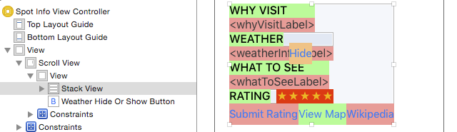

```metadata
number: "I"
title: "Introduction"
```

# Introduction

iOS 9 introduces a whole host of new features, many of them focused on improving the user experience. For example improvements to Siri, the News app and a re-engineered Notes app.

From a more developer-centric point of view, you'll see that there are loads of new APIs and technologies available for use in 3rd-party apps, many of which you get _for free_. For example, a huge new feature on iPad is Multitasking. If you've been using Adaptive Layout (as recommended in _iOS 8 by Tutorials_) you'll find that you have remarkably little work to do to become a multitasking-compliant app!

As part of the improvements to Siri, iOS 9 allows the indexing of the content _inside_ your app through CoreSpotlight. This not only allows your app to have influence _even when it's not running_, but through public indexing, you can have results from your app displayed on devices that _don't even have the app installed!_ This is a great opportunity to extend the reach of your app, potentially gaining more happy users and downloads.

As the iPhone lineup continues to advance, new hardware technologies are introduced, and this year is no different. iPhone 6s and iPhone 6s Plus represent the biggest shift in user interaction paradigm since the original iPhone, through 3D Touch. This measures the pressure with which the user is pressing the screen, and in turn, allows them to peek into view controllers. Users will expect this functionality within all apps, so it's really important to get up to speed fast.

The appearance of your app is of great importance to users, and over the past few iOS releases Apple has steadily been making improvements to Auto Layout. iOS 9 is now different, with stack views representing a huge simplification in layout implementation. With full support in Interface Builder, they allow you to achieve the complex designs you desire, without the explicit Auto Layout constraints that have caused the headaches of the past.

iOS is growing up fast — gone are the days when every 3rd-party developer knew everything about the OS. The sheer size of iOS can make new releases seem daunting. That's why the Tutorial Team has been working really hard to extract the important parts of the new APIs, and to present this information in an easy-to-understand tutorial format. This means you can focus on what you want to be doing — building amazing apps!

Get ready for your own private tour through the amazing new features of iOS 9. By the time you're done, your iOS knowledge will be completely up-to-date and you'll be able to benefit from the amazing new opportunities in iOS 9.

Sit back, relax and prepare for some high quality tutorials!


## What you need

To follow along with the tutorials in this book, you'll need the following:
- __A Mac running OS X Yosemite or later.__ You'll need this to be able to install the latest version of Xcode.
- __Xcode 7.0 or later.__ Xcode is the main development tool for iOS. You'll need Xcode 7.0 or later for all tasks in this book as Xcode 7.0 is the first version of Xcode to supports iOS 9 and Swift 2.0. You can download the latest version of Xcode for free on the Mac app store here: <https://itunes.apple.com/app/xcode/id497799835?mt=12>
- __One or more devices (iPhone, iPad, or iPod Touch) running iOS 9 or later.__ Most of the chapters in the book let you run your code on the iOS 9 Simulator that comes with Xcode. However, a few chapters later in the book require one or more physical iOS devices for testing.
  
Once you have these items in place, you'll be able to follow along with every chapter in this book. 


## Who this book is for

This book is for intermediate or advanced iOS developers who already know the basics of iOS and Swift development but want to upgrade their iOS 9 skills. 

- __If you are a complete beginner to iOS development__, we recommend you read through _The iOS Apprentice, 4th Edition_ first. Otherwise this book may be a bit too advanced for you.
- __If you are a beginner to Swift__, we recommend you read through either _The iOS Apprentice, 4th Edition_ (if you are a complete beginner to programming), or _The Swift Apprentice_ (if you already have some programming experience) first.

If you need one of these prerequisite books, you can find them on our store here:

<http://www.raywenderlich.com/store>

As with raywenderlich.com, all the tutorials in this book are in Swift.


## How to use this book

This book can be read from cover to cover, but we don't recommend using it this way unless you have a lot of time and are the type of person who just "needs to know everything". (It's okay; a lot of our tutorial team is like that, too!)

Instead, we suggest a pragmatic approach — pick and choose the chapters that interest you the most, or the chapters you need immediately for your current projects. Most chapters are self-contained, so you can go through the book in a non-sequential order.

Looking for some recommendations of important chapters to start with? Here's our suggested Core Reading List: 

- Chapter 1, "Swift 2.0"
- Chapter 2, "Introducing App Search"
- Chapter 4, "App Thinning"
- Chapter 6, "3D Touch"
- Chapter 7, "UIStackView & Auto Layout changes"

That covers the "Big 5" topics of iOS 9; from there you can dig into other topics of particular interest to you. 


## Book overview

iOS 9 has a selection of new technologies and APIs that cover the entire OS. Here's what you'll learn about in this book:

1. __Chapter 1, Swift 2.0:__ Swift is only a year old, but a lot has changed since it was born. Discover the new error handling model, protocol extensions, new control flow features and much more! You'll be ready to tackle the rest of the book, and to upgrade your existing code to Swift 2.0!
2. __Chapter 2, Introducing App Search:__ With iOS 9, users can search inside your apps using the system Spotlight utility. Learn how to adopt this new functionality, and make the content inside your apps more discoverable.
   
3. __Chapter 3, Your App on the Web:__ Deep linking will allow you to direct users browsing your website directly to the correct point inside your iOS app. Find out how to integrate this functionality in your own site and app as you follow along with updating the RWDevCon website and app!
4. __Chapter 4, App Thinning:__ App Thinning describes a collection of new App Store technologies that ensure that users downloading your app only download exactly what their specific device requires. Discover what you need to do to adopt App Thinning, together with how you can split your app's resources up into chunks that are only downloaded from the App Store when they are required.
5. __Chapter 5, Multitasking:__ Completely new to iOS 9 is the ability to run two apps side-by-side on iPads. Get up to speed on what you need to do to ensure your apps are ready for multitasking.
   
6. __Chapter 6, 3D Touch:__ The iPhone 6s and iPhone 6s Plus introduced a new technology called 3D Touch. Discover how to detect the force of a touch in iOS 9, and the new interaction paradigms—such as pop and peek—that come along with it.
7. __Chapter 7, UIStackView & Auto Layout changes:__ Stack views will change the way you build your interfaces. They remove a lot of the boilerplate Auto Layout and make it really easy to construct simple layouts. Learn the basics of stack views and many of the other new Auto Layout features.
8. __Chapter 8, Intermediate UIStackView:__ Dive deeper into stack views — covering nesting, animation and working with them in code.
   
9. __Chapter 9, What's New in Storyboards?:__ Ever faced the problem of unmanageably large storyboards? Discover how to refactor your huge storyboard into smaller segments with new storyboard references.
10. __Chapter 10, Custom Segues:__ Creating custom view controller transitions has never been an easy task, but iOS 9 chips away at some of the complexity. Learn how to create your own custom segues to make custom transitions between view controllers far easier to understand.
   
11. __Chapter 11, UIKit Dynamics:__ iOS 9 includes loads of great improvements to UIKit Dynamics — making it really easy to model complex physics animations within your apps. Learn all about the new behaviors and debugging improvements as you build a real-world example.
12. __Chapter 12, Contacts:__ Accessing the on-device contacts has been challenging in the past — with a C-level API. iOS 9 introduces two new frameworks to ease interaction with the contacts. Discover how to integrate with the device address book in a much simpler manner.
13. __Chapter 13, Testing:__ Xcode 7 now includes a fully-featured solution for creating UI tests for your application. Discover how to add UI tests to your own apps, and review some of the other improvements to testing.
14. __Chapter 14, Location & Mapping:__ It's finally possible to choose your favorite color for a map pin! Learn about this, transit directions, Core Location enhancements and more!
15. __Chapter 15, What's New in Xcode?:__ There's loads of cool new stuff in iOS 9, but don't forget about your friendly IDE! Learn how the improved gauges make optimizing your app really easy, along with many other new features.
   

## Book source code and forums

This book comes with the Swift source code for each chapter. You can get the source code for the book here:

<http://www.raywenderlich.com/store/ios-9-by-tutorials/source-code>

 Some of the chapters have starter projects or other required resources, so you'll definitely want them close at hand as you go through the book.

We've also set up an official forum for the book at <raywenderlich.com/forums>. This is a great place to ask questions about the book, discuss making apps with iOS 9 in general, share challenge solutions, or to submit any errors you may find.


## PDF Version

We also have a PDF version of this book available, which can be handy if you ever want to copy/paste code or search for a specific term through the book as you're developing. 

And speaking of the PDF version, we have some good news!

Since you purchased the physical copy of this book, you are eligible to buy the PDF version at a significant discount if you would like (if you don't have it already). For more details, see this page:

<http://www.raywenderlich.com/store/ios-9-by-tutorials/upgrade>


## License

By purchasing _iOS 9 by Tutorials_, you have the following license:

- You are allowed to use and/or modify the source code in _iOS 9 by Tutorials_ in as many apps as you want, with no attribution required.
- You are allowed to use and/or modify all art, images, or designs that are included in _iOS 9 by Tutorials_ in as many apps as you want, but must include this attribution line somewhere inside your app: "Artwork/images/designs: from the _iOS 9 by Tutorials_ book, available at <http://www.raywenderlich.com>".
- The source code included in _iOS 9 by Tutorials_ is for your own personal use only. You are NOT allowed to distribute or sell the source code in _iOS 9 by Tutorials_ without prior authorization.
- This book is for your own personal use only. You are NOT allowed to sell this book without prior authorization, or distribute it to friends, co-workers, or students; they must to purchase their own copy instead.

All materials provided with this book are provided on an "as is" basis, without warranty of any kind, express or implied, including but not limited to the warranties of merchantability, fitness for a particular purpose and non-infringement. In no event shall the authors or copyright holders be liable for any claim, damages or other liability, whether in an action of contract, tort or otherwise, arising from, out of or in connection with the software or the use or other dealings in the software.

All trademarks and registered trademarks appearing in this guide are the property of their respective owners.


## Acknowledgments

We would like to thank many people for their assistance in making this possible:

- __Our families:__ For bearing with us in this crazy time as we worked all hours of the night to get this book ready for publication!
- __Everyone at Apple:__ For developing an amazing operating system and set of APIs, for constantly inspiring us to improve our apps and skills, and for making it possible for many developers to have their dream jobs!
- __And most importantly, the readers of raywenderlich.com — especially you!__ Thank you so much for reading our site and purchasing this book. Your continued readership and support is what makes all of this possible!


