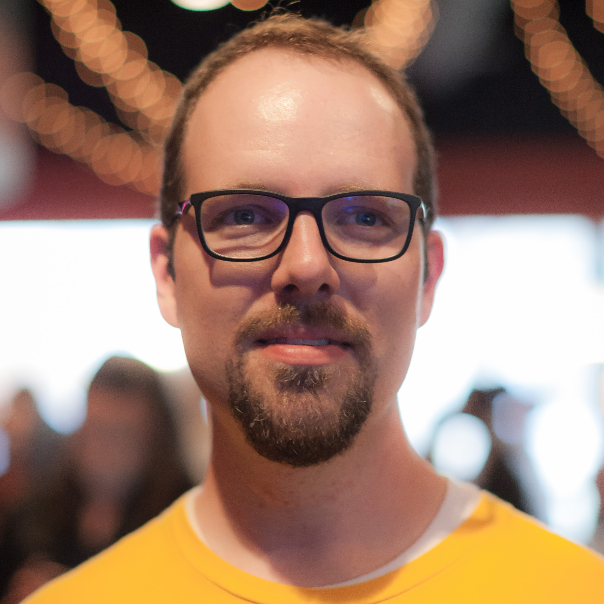
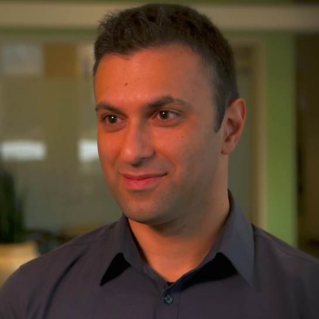
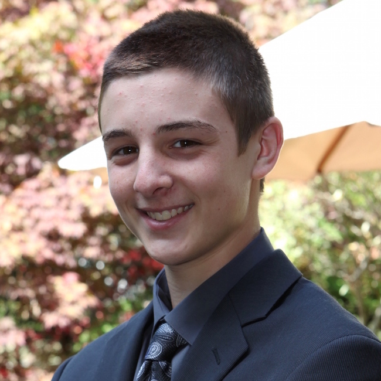

# About the Team

## Authors

### Aaron Douglas

Aaron was that kid taking apart the mechanical and electrical appliances at five years of age to see how they worked. He never grew out of that core interest - to know how things work. He took an early interest in computer programming, figuring out how to get past security to be able to play games on his dad's computer. He's still that feisty nerd, but at least now he gets paid to do it. 

Aaron works for Automattic (WordPress.com, Akismet, SimpleNote) as a Mobile Maker primarily on the WordPress for iOS app.

Find Aaron on Twitter as @astralbodies or at his blog at http://astralbodi.es

### Soheil Azarpour

I'm an engineer, developer, author, creator, husband and father. I enjoy bicycling, boating and playing piano. I live in Manchester, NH. I create iOS apps professionally and independently.

### Evan Dekhayser

Evan Dekhayser is a high school student, as well as an iOS developer. He first learned Python in 2012, and has since built up his knowledge of Objective C and Swift. He enjoys playing and watching baseball, and is always looking for intriguing topics to learn and potentially write about.

### Caroline Begbie

Caroline is an indie iOS developer and likes to relax with animation software, Arduino and electronics.  In her previous life she taught the elderly how to use their computers, performed marionette shows in schools, and ran a software company in Silicon Valley.

### Pietro Rea

Pietro is a software engineer at Quidsi, where he builds e-commerce iOS applications for Diapers.com, Wag.com, Soap.com and 7 other brands. Previously, he's worked on the Huffington Post's mobile team. You can find Pietro on Twitter as @pietrorea.

## Editors

### Richard Turton

Richard is an iOS developer for MartianCraft, prolific Stack Overflow participant and author of a development blog, Command Shift. When he's not in front of a computer he is usually building Lego horse powered spaceships (don't ask!) with his daughter.

