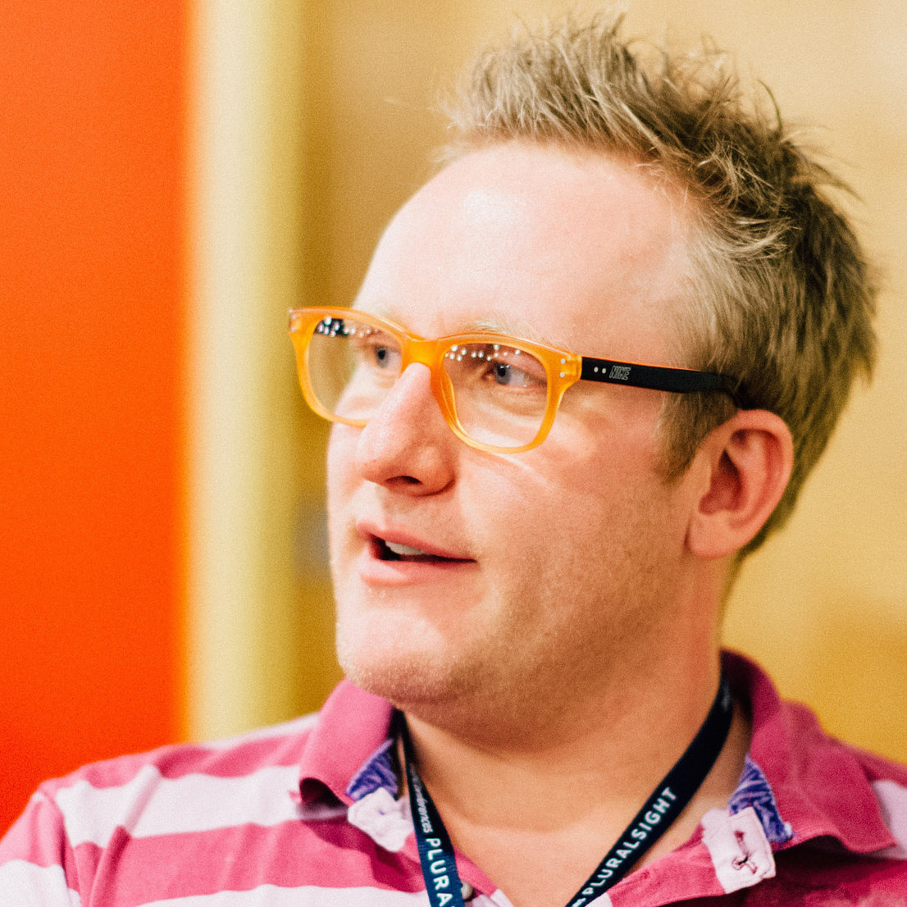

## About the authors

__Jawwad Ahmad__ is a freelance iOS Developer that dove into Swift head first and has not looked back. He enjoys mentoring and teaching and was the original founder of the of the NYC iOS Study Group. He's worked for companies as large as The New York Times, and as small as GateGuru, a 6 person startup.

__Soheil Azarpour__ is an engineer, developer, author, creator, husband and father. He enjoys bicycling, boating and playing piano. He lives in Manchester, NH. Soheil creates iOS apps professionally and independently.

__Caroline Begbie__ is an indie iOS developer and likes to relax with animation software, Arduino and electronics.  In her previous life she taught the elderly how to use their computers, performed marionette shows in schools, and ran a software company in Silicon Valley.

__Evan Dekhayser__ is a high school student, as well as an iOS developer. He first learned Python in 2012, and has since built up his knowledge of Objective C and Swift. He enjoys playing and watching baseball, and is always looking for intriguing topics to learn and potentially write about.

_Aaron Douglas__ was that kid taking apart the mechanical and electrical appliances at five years of age to see how they worked. He never grew out of that core interest - to know how things work. He took an early interest in computer programming, figuring out how to get past security to be able to play games on his dad's computer. He's still that feisty nerd, but at least now he gets paid to do it. 

Aaron works for Automattic (WordPress.com, Akismet, SimpleNote) as a Mobile Maker primarily on the WordPress for iOS app.

Find Aaron on Twitter as @astralbodies or at his blog at http://astralbodi.es

__James Frost__ is a senior iOS developer at Mubaloo Ltd, and lives in Bristol, UK. He taught himself to code in the early 90s on his family's BBC B, and was instantly hooked. He loves learning new things and teaching others, and enjoys spending time with his wife and son, reading, playing games, and cooking. You can find him on his blog at: http://www.jamesfrost.co.uk or as @frosty on Twitter.

__Vincent Ngo__ is a full time iOS software engineer at IBM. He graduated from Virginia Tech with a Computer Science degree. He has passion for developing, sharing, and learning about what's new with the iOS SDK. On the side he loves playing video games, strumming his guitar, hitting golf balls, and chilling with friends.

__Pietro Rea__ is a software engineer at Quidsi, where he builds e-commerce iOS applications for Diapers.com, Wag.com, Soap.com and 7 other brands. Previously, he's worked on the Huffington Post's mobile team. You can find Pietro on Twitter as @pietrorea.

__Derek Selander__ is an iOS developer who enjoys learning through debugging & disassembly to see how others have solved similar problems. In his free time, he enjoys surfing, playing classical guitar, and consuming bacon.

__Chris Wagner__ leads iOS development at Infusionsoft and has been developing for iOS since the release of the SDK in 2009. His background consists of gaming, customer support, systems administration and web development. When he's not working he enjoys spending time with his wife and son. By the time this is published our second son will have arrived!

## About the editors

__James Frost__ was a technical editor for this book. He is a senior iOS developer at Mubaloo Ltd, and lives in Bristol, UK. He taught himself to code in the early 90s on his family's BBC B, and was instantly hooked. He loves learning new things and teaching others, and enjoys spending time with his wife and son, reading, playing games, and cooking. You can find him on his blog at: [jamesfrost.co.uk](http://www.jamesfrost.co.uk) or as [@frosty](https://twitter.com/frosty) on Twitter.

__Jeff Rames__ was a technical editor for this book. He is a developer currently working at AirStrip where he builds enterprise iOS products in the healthcare space.  He discovered his passion for mobile software shortly after the iPhone SDK was released, and made it his full time gig in 2011 after a decade in the industry. He spends his free time with his wife and daughters, except when he abandons them for trips to Cape Canaveral to watch rockets being launched into space.

__Richard Turton__ was a technical editor for this book. He is an iOS developer for MartianCraft, prolific Stack Overflow participant and author of a development blog, Command Shift. When he's not in front of a computer he is usually building Lego horse powered spaceships (don't ask!) with his daughter.

__Chris Belanger__ was an editor for this book. He spends his days developing real-time industrial control applications; he fills the rest of his time with writing, editing, travelling, composing music, enjoying the great outdoors and appreciating the finer things in life. He's excited to have worked on yet another book with the great raywenderlich.com team and can't imagine life without this crazy, wonderful bunch.

__Wendy Lincoln__ was an editor for this book. By day, she manages complex content development projects and by night she escapes into the world of iOS. Before all this, she produced a cooking show named Hot Kitchen, wrote a cookbook and taught cooking classes. A few years ago she realized her love for writing, editing and playing with computers; she's never looked back.  Once in a while, her husband manages to tear her away from the computer for trips to the beach and random home improvement projects.

__Sam Davies__ was the final pass editor for this book. Sam is a strange mashup of developer, writer and trainer. By day you'll find him recording videos for Razeware, writing tutorials, attending conferences and generally being a good guy. By night he's likely to be out entertaining people, armed with his trombone and killer dance moves.

He'd like it very much if you were to say "hi" to him on twitter at [@iwantmyrealname](https://twitter.com/iwantmyrealname).

## About the artists

__Julien Martin__ was the artist...

